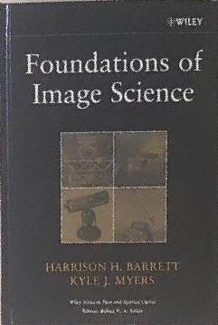
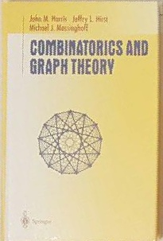
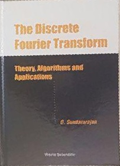

# Homography-and-Image-Warping
In some applications, we need to make changes to an image to make it clearer. for example, we may want to seperate a part of an image from the others and do some changes on it. One of the practical examples of this application is cam scanner software.

# Given Images

  

# Results

  
  
  

